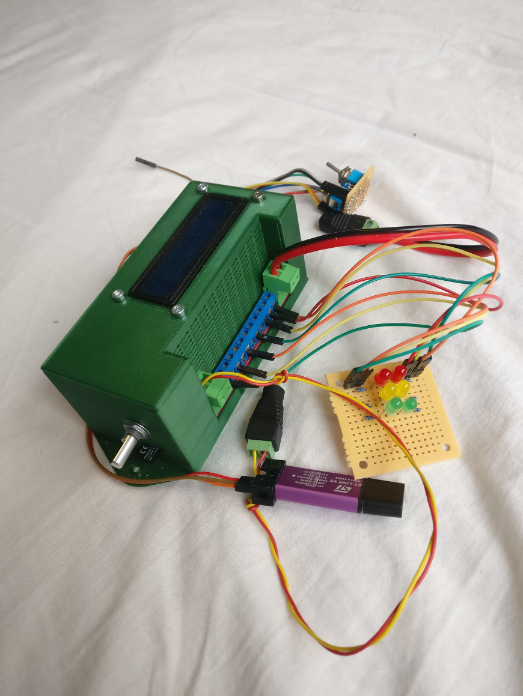
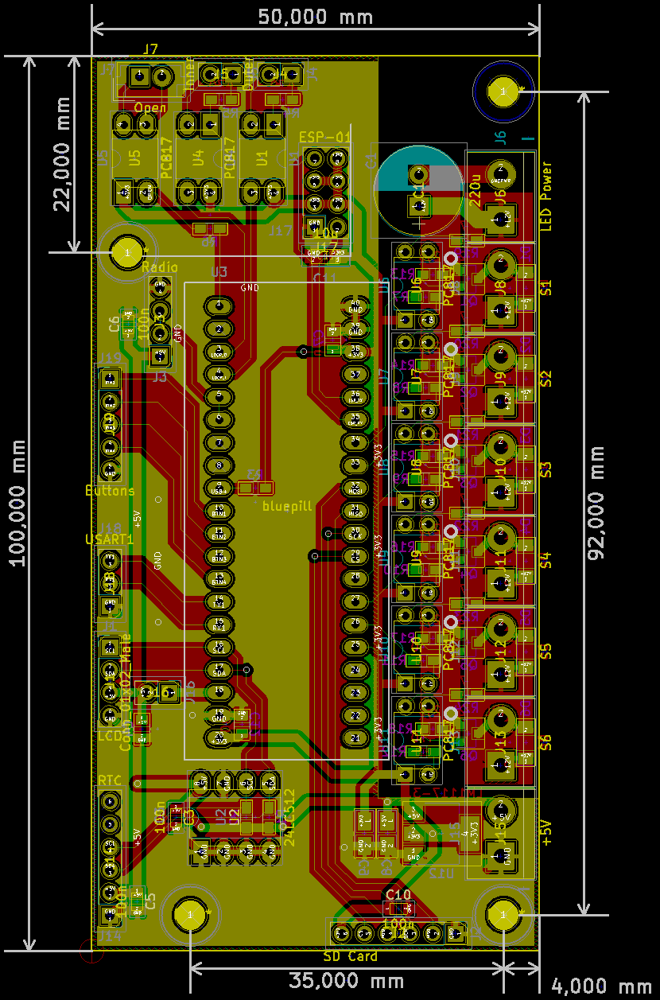
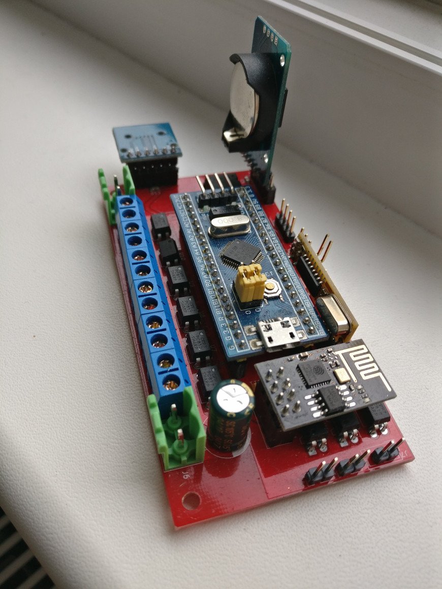

# Shared parking space access controller

## Features

Gate433 uses cheap, standard (and insecure) gate opener remotes operating on 433 MHz to control entry and exit of vehicles allowed to acces the parking area.

Each gate opener supposed to be assigned to one vehicle and has unique code. The main purpose of it is to make unfair usage of the parking as inconvinient as possible using commodity gate opener remotes.

Features list:

* 1024 possible remote codes
* Position of each vehicle (inside, outside, unknown) is remembered. Gate opening will be denied for unexpected movements (e.g vehicle which is already inside tries to enter again)
* Access time limits by direction can be set independently for any vehicle (e.g can enter Monday to Friday from 08:30 to 17:00, can leave Monday to Friday from 08:30 to 17:30)
* Vehicle database snd device configuration stored in EEPROM
* Log stored on SD card
* Database changes can be imported from SD card
* Exceptional days (e.g. National holydays) database on SD card
* Automatic DST handling
* Simple command line interpreter on serial for database manipulation, date/time setting, log manipulation and temperature query

## Hardware

There are two versions of the hardware: Original version used Arduino Nano as central component. It is obsoleted by the newer version based on a popular STM32F103C8T6 based minimal board widely known as BluePill. It's actually cheaper on eBay or Aliexpress than the total cost of the components it contains.

Both versions ar using two inputs (usually coming from inductive loop detectors) in addition to the RF signal to decide if a vehicke intends to enter or exit. A pair of tricolor traffic lighst provide feedback fo drivers.

Both versions have 6 opto-isolated open drain output for 12V LED traffic lights,one opto-isolated open collector output for gate opening and two opto-isolated input for inductive loop detectors.

Second iteration have three extra features compared to the first:

* WiFi to serial bridge for wireless communication
* Rotary encoder driven simpe user interface (yet to be implemented in the firmware)
* 3D printable case modelled in FreeCAD

Prototype of STM32 based version

## Firmware

Arduino Nano based firware was built on Arduino framework using Sloeber Arduino IDE. Source files persist in folders named "gatekeeper", "common" and "libs".  
STM32 version is completely separated as it is based on STM32Cube framework. STM32 sources are placed in "gatekeeper-stm32" and "stm32goodies" folder.

## Schematics and PCB

Arduino based first version hardware developed using proprietrary Eagle free version, and obsoleted by STM32 version but schematics of the [mainboard](docs/V1_mainboard.pdf) and the [IO panel](docs/V1_extio.pdf) are still available for reference.

As mentioned above, hardware of STM32 version designed using KiCAD. The complete EDA project is available in the hardware/STM32 folder. Here are the [schematics](docs/bluepill.pdf) in PDF for easier access.

PCB design for STM32 bsed version

Assembled STM32 panel with modules installed